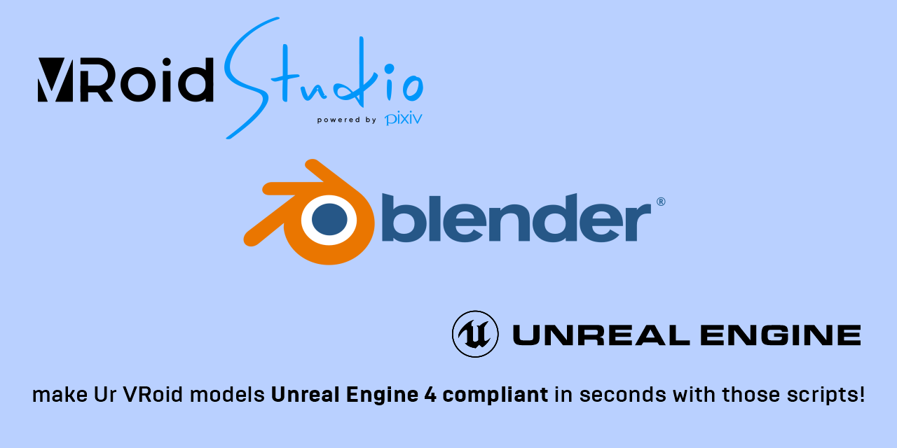

# VRoid to Unreal Engine Blender Scripts

 Unreal Engine is awesome, no debates there, but you want to make your VRoid models **Unreal** without much hassle?
 Then these scripts are for you, making your VRoid model Unreal ready!

 Execute the scripts on your VRoid models you imported to Blender, and you're steps closer to make your character **Unreal!**

# What are the scripts doing anyway?
 These are few automation scripts for Blender, and this README will be updated accordingly to explain what the scripts will do to your VRoid models.

 * **VRM_RenameKeys** : This script will rename all shape keys, using PAST FUTURE's naming conventions.

 * **VRM_RenameBones** : This script will rename all matching bones (except rigid hair bones) adhering to UE4 Manny's skeleton standards.

 * **VRM_AddHairRootBone** : This script will add a new bone for parenting hair bones that was parented to head bone.
   Useful for reducing AnimDynamics node count in your AnimBP.

 * **VRM_DeleteLeafBones** : By default, VRM Importer includes leaf bones automatically.
   It's cool and stuff, but it's not necessary for Blender, and will spew out scary long warning when imported to UE4.
   Use this script to obliterate those leaf bones in one click.

# Why are you making the scripts open?
 To share the knowledge and help others, that's why.

 I have been receiving direct messages from people, asking me how to put VRoid models into Unreal. Of course, explaining them
 one by one, again and again, would be a time consuming, and would take away my development time. At the same time, I don't
 want to be a selfish prick unwilling to share the knowledge to others, and thus, I decided to share documented scripts for
 VRoid/Blender and Unreal Engine users out there.
